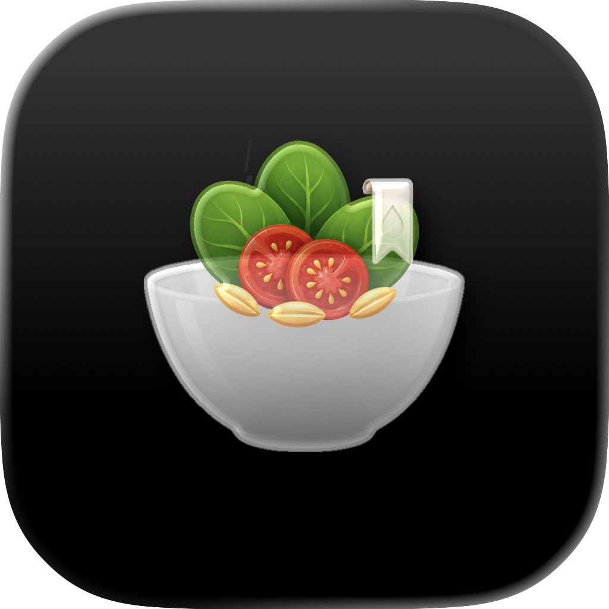
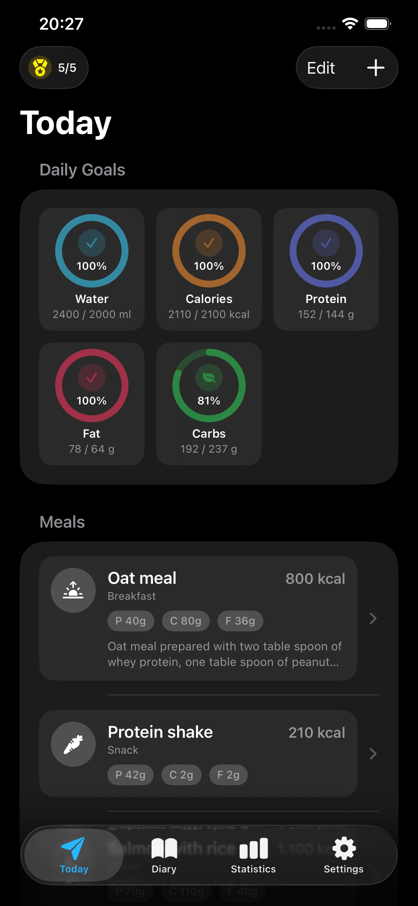
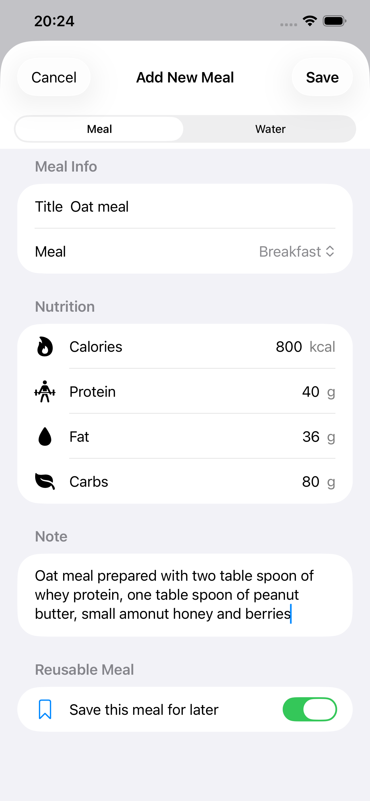
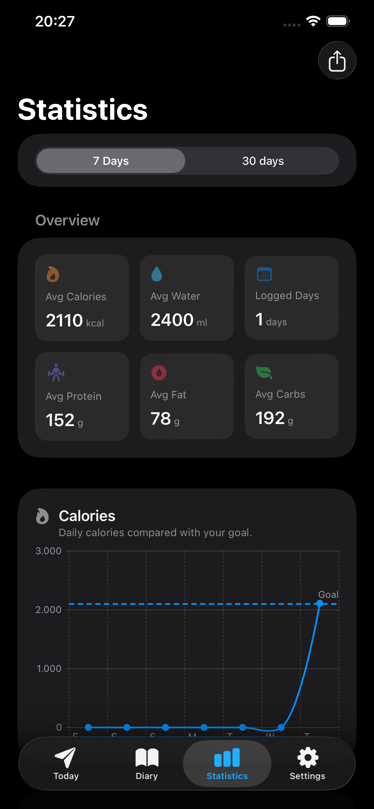

  

<h1 align="center">BowlNote</h1>

  <strong>Simple meal, water, and macro tracking for everyday use.</strong>

  BowlNote helps you log meals, track water intake, follow daily nutrition goals, and review your progress with simple statistics.

  <a href="https://ondersabahat.github.io/bowl-note/privacy-policy/">Privacy Policy</a>

---

## Preview

  
  
  

---

## Features

### Daily Goal Tracking

Track your daily progress for:

- Calories
- Water intake
- Protein
- Fat
- Carbohydrates

### Meal Diary

Log your meals with nutrition values and notes. Reorder meals, edit entries, and keep your daily diary organized.

### Saved Meals

Save frequently used meals and quickly add them again later.

### Water Tracking

Add water intake throughout the day and compare it with your personal goal.

### Statistics

Review your nutrition trends over selected time ranges, including calories, water, and macros.

### CSV Export

Export your statistics as a CSV file and save or share it using the iOS share sheet.

### Local Reminders

Enable optional reminders for water, meals, and weekly review notifications.

---

## Privacy

BowlNote is designed as a local-first app.

The app does not require an account, does not use advertising, does not use third-party analytics, and does not sell or share your data.

Read the full privacy policy here:

[Privacy Policy](https://ondersabahat.github.io/bowl-note/privacy-policy/)

---

## Health Disclaimer

BowlNote is intended for personal tracking and informational purposes only. It does not provide medical advice, diagnosis, or treatment. Please consult a healthcare professional before making medical decisions or major diet changes.

---

## Contact

For questions or support:

**Önder Şabahat**  
ondersabahat@gmail.com
